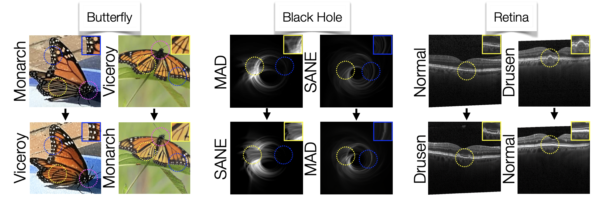

# Teaching Humans Subtle Differences with *DIFF*usion
<!-- <a href="https://openreview.net/forum?id=rm9ewAwLTR&referrer=%5BAuthor%20Console%5D(%2Fgroup%3Fid%3Dthecvf.com%2FICCV%2F2025%2FConference%2FAuthors%23your-submissions)"></a> -->
<a href="https://diff-usion.cs.columbia.edu/"></a> 

Official implementation of **Teaching Humans Subtle Differences with *DIFF*usion**.


We illustrate the counterfactual results from our methods on the Butterfly dataset, the Black
Hole dataset, and the Retina dataset. In the Butterfly dataset, the Viceroy has a cross-sectional line (${\color{yellow}\text{yellow}}$), a smaller head with less dots
(${\color{magenta}\text{magenta}}$), and more “scaley” dots (${\color{blue}\text{blue}}$), compared to the Monarch. In the Black Hole dataset, SANE has more uniform wisps (${\color{yellow}\text{yellow}}$)
and less of a prominent photon ring (${\color{blue}\text{blue}}$) as compared to MAD, with these distinguishing features discovered through our method rather
than known a priori. In the Retina dataset, normal retinas lack the horizontal line bumps (${\color{yellow}\text{yellow}}$) present in retinas with drusen.


## Setup
Create conda environment:
```bash
$ conda create -p /proj/vondrick4/mia/condaenvs/diff-usion python=3.9
$ conda activate diff-usion
```
Clone and install requirements:
```bash
$ git clone https://github.com/cvlab-columbia/diff-usion
$ cd diff-usion
$ pip install -r requirements.txt
```

## Gradio demo 

We've made a gradio demo that automatically runs our method end-to-end given just your dataset (extracts embeds, trains classifiers, finetune's the diffusion model, and runs our arithmetic edit!). To run it in reasonable time, it requires GPUs, so we've provided the gradio demo code for you to run on your own machine. Alternatively, you can run the code yourself via the next sections.

To run the gradio demo, run:
```bash
$ python gradio_diff-usion_demo.py
```

## Usage
### Dataset format
To use your own dataset, add a dataset class to the `datasets.py` file. This dataset should return a tuple of (image, label, filename). There should only be two classes, and the labels should be 0 or 1. You will also need to modify the `get_cls_dataset_by_name` function to return your dataset, and create a config file for each folder in the `configs` folder: one for fine-tuning lora (optional) the diffusion model (`lora`), one for training the ensemble classifiers (`ensemble`), and one for editing (`edit`). 

### (Optional) Domain Tuning on YOUR dataset
To finetune our diffusion decoder on a new dataset, modify the example config file according to your dataset location and run:
```bash
$ python kandinsky_lora_train.py --config_path configs/lora/retina.yaml
```

### Locate source and target CLIP embedding files (or create your own)
To save CLIP features for YOUR own dataset, run:
```bash
$ python scripts/save_embeds.py
```

### Locate ensemble classifiers (or train your own)
To train our set of ensemble classifiers, run:
```bash
$ python scripts/ensemble_train.py --config_path configs/ensemble/retina.yaml
```

### Modify config file
The image editing config file is in `configs/edit` folder, and we have provided an example one for the retina dataset.

### Run inference
```bash
$ python kandinsky_eval.py --config_path configs/edit/retina.yaml
```

### Crate GIFs
```bash
$ python make_gif.py --config_path configs/edit/retina.yaml
```

## Citation

